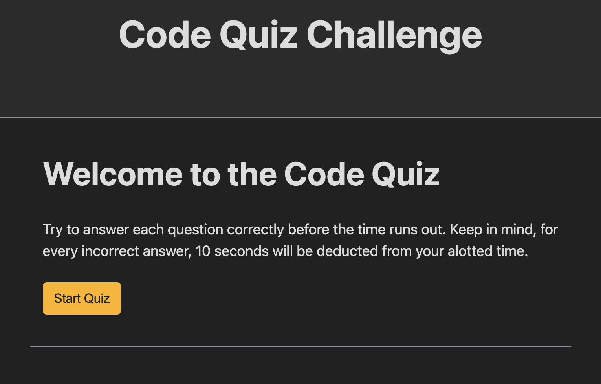

# Code Quiz

[Link to my project](https://ryan-young17.github.io/code-quiz/)

## Table of Contents
- [Description](#description)
- [Visuals](#visuals)

## Description

This application is a coding quiz that takes you through five, multiple choice questions about the basics of coding. Once the start button is clicked, a 60-second timer begins with 5 seconds deducted for every wrong answer chosen. For every correct answer, 10 points is added to the user's score.

Once the quiz is complete or the timer reaches 0, the user is presented with their score and an option to save it by inputting their initials and clicking "submit". The saved score is then listed on the "High Scores" screen with an option to restart.

## Visuals

